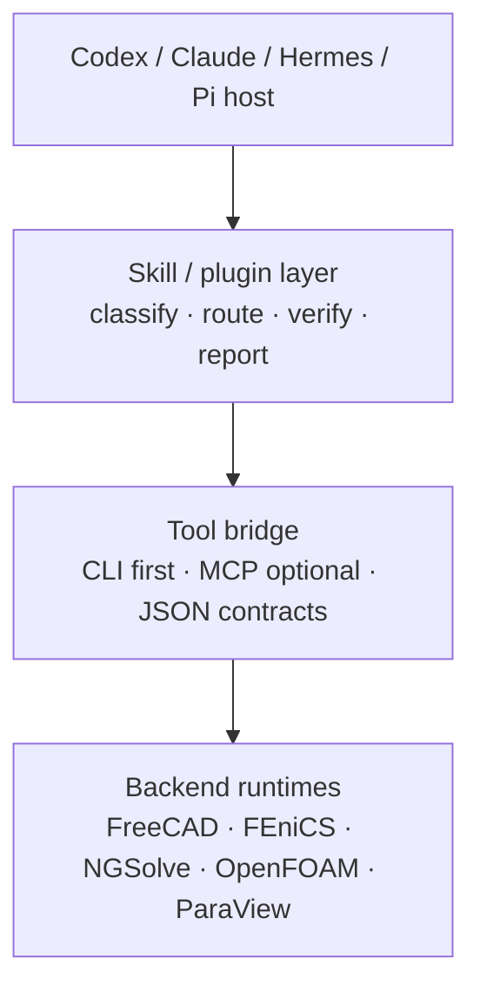

# Robin CAD Sim Studio

[](https://github.com/Yaobin29/robin-cad-sim-studio/actions/workflows/validate.yml)

Portable CAD-to-simulation workflow plugin for Codex, Claude, Hermes, and Pi-style agent hosts.

Robin CAD Sim Studio gives an agent one memorable entry point for:

```text
CAD -> mesh -> simulation -> verification -> evidence/report
```

It is a workflow and contract layer, not an LLM distribution and not a replacement for the underlying solvers. The host agent supplies reasoning and tool calling; this plugin supplies scientific routing, evidence gates, output conventions, and portable machine-readable contracts.

## Why this exists

CAD and simulation work often spans several tools with different interfaces and result formats. That creates three recurring problems:

1. The agent loads too many low-level skills before it understands the task.
2. CLI, MCP, and GUI-backed tools return incompatible handoff data.
3. A solver run can be mistaken for a scientifically credible result.

This plugin addresses those problems with a small onion architecture:



The three agent-facing layers are host runtime, tool bridge, and skill/plugin. Backend runtimes remain independent execution payloads behind the bridge and can be upgraded without rewriting the research routing layer.

## What it provides

- One high-level entry point: `robin-cad-sim-studio`
- Intent classification using `WHY`, `HOW`, and `MIX`
- Route selection for CAD/FEM, microfluidic CFD, special physics, result verification, and reporting
- Shared `TaskBrief`, `RoutePlan`, `RunSummary`, and `EvidenceReport` schemas
- CLI-first deterministic execution with optional MCP live-session bridges
- Codex, Claude, and Hermes/Pi-style adapter surfaces
- Explicit `ok`, `partial`, and `blocked` states
- Evidence rules that separate direct solver results, visual evidence, proxy interpretation, and validation

The plugin does not bundle an LLM, solver binaries, Python environments, Fusion 360, ParaView, or credentials.

## Workflow branches

| User intent | Branch | Preferred execution |
| --- | --- | --- |
| CAD, mesh, elasticity, diffusion, general FEA/CFD | `general-fem` | FreeCAD/Blender + FEniCS or NGSolve |
| T-junction, GelMA/oil droplets, routine chip flow | `microfluidic-cfd` | OpenFOAM, with ParaView verification |
| Electrokinetics or another special PDE | `microfluidic-special-physics` | FEniCS/FEniCSx special branch |
| Existing XDMF/VTK fields, screenshots, video, field inspection | `result-verification` | ParaView CLI and scientific evidence checks |
| Existing analysis bundle to Markdown/HTML/PPTX | `simulation-report` | Downstream reporting consumer |

The outer skills are routers and workflow contracts. Leaf capabilities such as `freecad-cli`, `fenics-cli`, `ngsolve-cli`, `openfoam-cli`, and `paraview-cli` remain separate because selection, execution, and verification are different responsibilities.

## Shared contracts

The schemas live in [`contracts/`](contracts/):

| Contract | Purpose |
| --- | --- |
| [`TaskBrief`](contracts/task-brief.schema.json) | Normalize objective, `WHY`/`HOW`/`MIX`, geometry, physics, constraints, and requested outputs |
| [`RoutePlan`](contracts/route-plan.schema.json) | Record branch, backend candidates, MCP need, verification gates, and fallback policy |
| [`RunSummary`](contracts/run-summary.schema.json) | Carry run identity, backend, paths, metrics, assumptions, limits, and verification status |
| [`EvidenceReport`](contracts/evidence-report.schema.json) | Separate direct evidence, visual evidence, proxy interpretation, validation, and next action |

CLI and MCP adapters should converge on the same `RunSummary`. A missing backend must produce a truthful `blocked` result, never a fabricated success.

## Quick start

Clone the repository and run the portable checks:

```bash
git clone https://github.com/Yaobin29/robin-cad-sim-studio.git
cd robin-cad-sim-studio

python3 scripts/validate-contracts
python3 scripts/discover-backends
python3 scripts/package-cross-agent --dry-run
```

`discover-backends` checks command discoverability only. It does not prove that a solver can run or that a model is scientifically valid.

## Host adapters

### Codex

Codex-compatible metadata is in [`.codex-plugin/plugin.json`](.codex-plugin/plugin.json). Load the repository as a local plugin through your Codex marketplace or local plugin workflow. The default [`.mcp.json`](.mcp.json) is intentionally empty so that machine-specific MCP services are not silently enabled.

An optional Fusion 360 registration example is in [`adapters/codex/mcp.example.json`](adapters/codex/mcp.example.json).

### Claude

Build a Claude-uploadable archive:

```bash
python3 scripts/package-cross-agent
```

The output is written under `outputs/robin-cad-sim-studio/` and contains one top-level plugin folder with `.claude-plugin/plugin.json`, `skills/`, contracts, references, and adapters. Codex-only metadata is excluded from the archive.

### Hermes and Pi-style hosts

Sync the shared Agent Skills directories without touching credentials:

```bash
python3 adapters/hermes/sync-skills.py --dry-run
python3 adapters/hermes/sync-skills.py --apply
python3 adapters/hermes/register-mcp.py
```

The sync destination is controlled by `HERMES_SKILLS_ROOT` and otherwise defaults to `~/.hermes/skills/engineering/robin-cad-sim-studio`.

## CLI, MCP, and backend boundary

- **CLI** is the default for batch jobs, reproducible runs, health checks, and machine-readable output.
- **MCP** is optional for live Fusion 360 sessions, GUI state, interactive tools, or future session-aware bridges.
- **Skills** decide what should happen and what evidence is required.
- **Backends** execute deterministic CAD, meshing, solving, and rendering operations.

Do not merge OpenFOAM, FEniCS, NGSolve, FreeCAD, and ParaView into one giant skill. Keep their runtimes independently replaceable behind the shared route and result contracts.

## Evidence and safety rules

For important work, record:

- problem description
- problem type: `WHY`, `HOW`, or `MIX`
- core goal and current gap
- smallest useful model
- current action and next minimal action

Use these run states:

- `ok`: requested execution and required artifacts completed
- `partial`: some requested evidence or verification gates are missing
- `blocked`: a required input, backend, MCP bridge, or runtime is unavailable

For VOF droplet claims, require both a visual sequence and connected-component evidence for `alpha.water > 0.25` and `alpha.water > 0.5`. Interpolated frames are visualization smoothing, not new physical evidence.

Keep generated files under `outputs/`; research outputs should use `outputs/research/<YYYY-MM>/`. Never create a top-level `03-research/` or nested `outputs/outputs/`. Do not put secrets, credentials, or host working memory in this repository.

## Repository layout

```text
.
├── .codex-plugin/          # Codex manifest
├── .claude-plugin/         # Claude manifest
├── adapters/               # Thin host-specific adapters
├── assets/                 # Portable templates and fixtures
├── contracts/              # Shared JSON schemas
├── evals/                  # Positive, boundary, negative, regression cases
├── references/             # Routing, evidence, and installation guidance
├── scripts/                # Deterministic discovery, validation, packaging
└── skills/                 # Host-loadable routing skills
```

## Scope and limitations

This repository standardizes agent-facing orchestration; it does not promise that every backend is installed on every machine. Solver fidelity, mesh sensitivity, boundary conditions, constitutive assumptions, and validation data remain domain-specific. A successful command is not automatically a validated scientific conclusion.

## Contributing

See [`CONTRIBUTING.md`](CONTRIBUTING.md). Changes to routing behavior should include at least one positive, boundary, negative, or regression eval in [`evals/evals.json`](evals/evals.json), plus contract and packaging checks.

## License

MIT. See [`LICENSE`](LICENSE).
